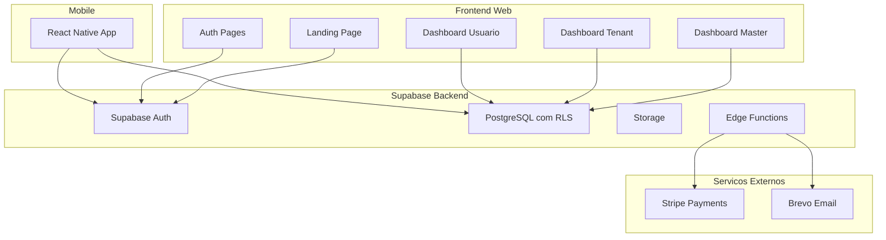
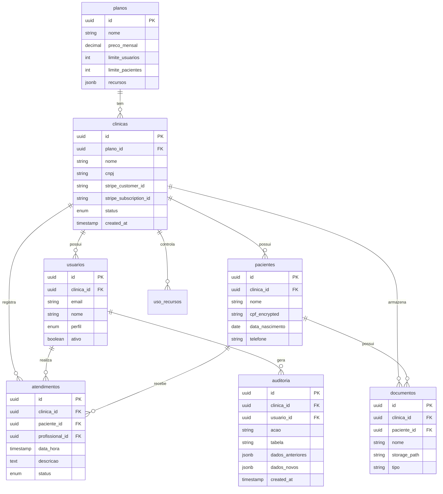

# Plano de Desenvolvimento - MVP ClinicOps

## Contexto e Estrategia

O PRD define uma plataforma SaaS multi-tenant robusta. Com 1 semana de prazo, a estrategia sera:

- **Priorizar funcionalidades demonstraveis** que evidenciem o dominio tecnico
- **Usar componentes prontos** (shadcn/ui) para acelerar o frontend
- **Implementar RLS desde o inicio** - diferencial tecnico obrigatorio
- **Mobile responsivo primeiro**, app nativo como bonus

---

## Arquitetura Proposta



---

## Modelo de Dados



---

## Fases de Desenvolvimento

### FASE 1: Fundacao e Infraestrutura (Dias 1-2)

**Objetivo**: Setup completo do ambiente e estrutura base

**Dia 1 - Setup e Banco de Dados**

- Criar projeto Next.js 14 com App Router e TypeScript
- Configurar Tailwind CSS + shadcn/ui
- Criar projeto no Supabase
- Implementar schema completo do banco de dados
- Configurar RLS em todas as tabelas (clinica_id)
- Criar funcoes auxiliares no PostgreSQL para RLS

**Dia 2 - Autenticacao e Estrutura**

- Integrar Supabase Auth (email/senha)
- Implementar middleware de autenticacao
- Criar estrutura de rotas protegidas
- Desenvolver layout base dos dashboards
- Implementar Context/Provider para gestao de tenant
- Criar hook useAuth e useClinica

**Entregas**:

- Projeto funcional com login/logout
- Banco de dados estruturado com RLS ativo
- Estrutura de pastas organizada

---

### FASE 2: Dashboards e CRUD Principal (Dias 3-4)

**Objetivo**: Funcionalidades core dos tres perfis de usuario

**Dia 3 - Dashboard Master e Admin Tenant**

- Dashboard Master (Admin Plataforma):
  - Listagem de clinicas cadastradas
  - Gestao de planos (CRUD)
  - Metricas globais (total clinicas, usuarios, receita)
  - Controle de assinaturas
- Dashboard Admin Tenant:
  - Gestao de usuarios da clinica
  - Visualizacao do plano atual
  - Metricas da clinica

**Dia 4 - Dashboard Usuario e Pacientes**

- Dashboard Usuario Operacional:
  - CRUD de pacientes
  - Registro de atendimentos
  - Upload de documentos
- Implementar filtros e busca
- Implementar paginacao
- Validacoes de formulario com Zod

**Entregas**:

- Tres dashboards funcionais
- CRUD completo de pacientes e atendimentos
- Sistema de upload de documentos

---

### FASE 3: Integracao Stripe e Landing Page (Dia 5)

**Objetivo**: Monetizacao e conversao

**Componentes**:

- Landing Page institucional com:
  - Hero section
  - Features/beneficios
  - Depoimentos
  - CTA para cadastro
- Pagina de Pricing com:
  - Cards de planos
  - Comparativo de recursos
  - Botao de checkout
- Integracao Stripe:
  - Criar produtos/precos no Stripe
  - Checkout Session via Edge Function
  - Webhook para atualizar status da assinatura
  - Portal do cliente para gestao

**Entregas**:

- Landing page responsiva
- Fluxo de assinatura funcional
- Webhook processando eventos do Stripe

---

### FASE 4: Auditoria e Compliance (Dia 6)

**Objetivo**: Rastreabilidade e LGPD

**Componentes**:

- Sistema de auditoria:
  - Triggers no PostgreSQL para log automatico
  - Registro de create/update/delete
  - Visualizacao de logs por admin
- Seguranca adicional:
  - Criptografia de campos sensiveis (CPF)
  - Rate limiting via Edge Functions
  - Validacao de permissoes por perfil
- E-mails transacionais (Brevo):
  - Boas-vindas ao cadastro
  - Confirmacao de assinatura
  - Recuperacao de senha

**Entregas**:

- Logs de auditoria funcionais
- Dados sensiveis criptografados
- E-mails automatizados configurados

---

### FASE 5: Mobile e Deploy Final (Dia 7)

**Objetivo**: App mobile e publicacao

**Mobile (React Native + Expo)**:

- Setup do projeto Expo
- Reutilizar logica de autenticacao
- Telas principais:
  - Login
  - Lista de pacientes
  - Detalhes do paciente
  - Registro de atendimento
- Navegacao com React Navigation

**Deploy**:

- Deploy do frontend na Vercel
- Configurar dominio (se disponivel)
- Variaveis de ambiente em producao
- Testes finais end-to-end
- Documentacao basica no README

**Entregas**:

- App mobile funcional (APK/TestFlight se possivel)
- Aplicacao web publicada com URL funcional
- Projeto no GitHub com README

---

## Estrutura de Pastas Sugerida

```
clinicops/
├── apps/
│   ├── web/                    # Next.js App
│   │   ├── app/
│   │   │   ├── (auth)/         # Rotas publicas
│   │   │   │   ├── login/
│   │   │   │   ├── register/
│   │   │   │   └── forgot-password/
│   │   │   ├── (dashboard)/    # Rotas protegidas
│   │   │   │   ├── master/     # Admin plataforma
│   │   │   │   ├── admin/      # Admin tenant
│   │   │   │   └── app/        # Usuario operacional
│   │   │   ├── (marketing)/    # Landing, Pricing
│   │   │   └── api/            # API Routes
│   │   ├── components/
│   │   │   ├── ui/             # shadcn/ui
│   │   │   └── shared/         # Componentes compartilhados
│   │   ├── lib/
│   │   │   ├── supabase/
│   │   │   ├── stripe/
│   │   │   └── utils/
│   │   └── hooks/
│   └── mobile/                 # React Native App
│       ├── app/                # Expo Router
│       ├── components/
│       └── lib/
├── packages/
│   └── shared/                 # Tipos e utils compartilhados
└── supabase/
    ├── migrations/             # SQL migrations
    └── functions/              # Edge Functions
```

---

## Checklist de Entrega (conforme PRD)

- [ ] Frontend 100% funcional (Next.js + TypeScript + Tailwind + shadcn/ui)
- [ ] Backend 100% funcional (Supabase com RLS)
- [ ] Multi-tenancy com Row Level Security
- [ ] Tres perfis de usuario funcionais
- [ ] Integracao Stripe para assinaturas
- [ ] Landing Page e Pricing
- [ ] Sistema de auditoria
- [ ] App mobile basico (React Native + Expo)
- [ ] Projeto publicado com URL funcional
- [ ] Codigo no GitHub
- [ ] PRD anexado ao projeto

---

## Riscos e Mitigacoes

| Risco | Mitigacao |

|-------|-----------|

| Prazo apertado para mobile completo | Priorizar web, mobile com funcoes essenciais |

| Complexidade do RLS | Usar templates de policies do Supabase |

| Integracao Stripe | Usar modo teste, documentacao oficial |

| Escopo grande | Manter foco no MVP, evitar gold plating |

---

## Proximos Passos Imediatos

1. Confirmar este plano
2. Criar projeto Next.js e configurar Supabase
3. Implementar schema do banco com RLS
4. Desenvolver autenticacao e estrutura base